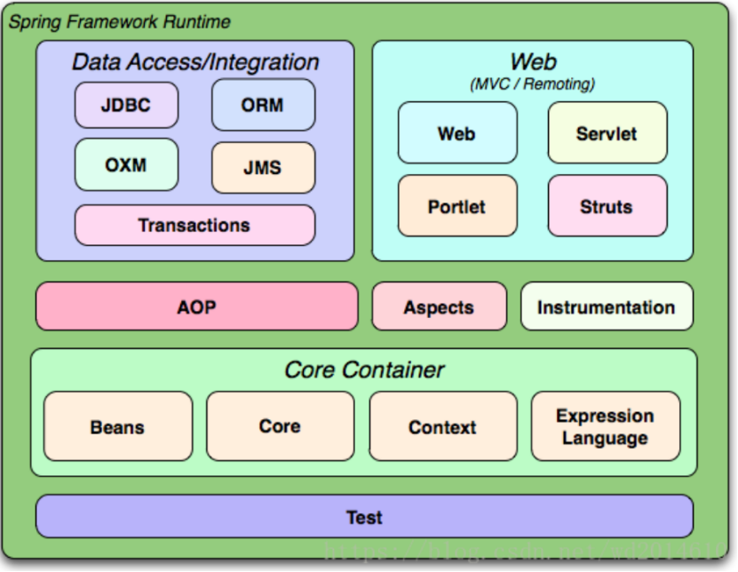

#Java Spring

###控制反转（IOC）

IoC就是Inversion of Control，控制反转。在Java开发中，IoC意味着将你设计好的类交给系统去控制，而不是在你的类内部控制。这称为控制反转。

将对象的创建和获取提取到外部。由外部容器提供需要的组件。

###AOP(面向切面编程)技术

struts，hibernate，mybatis，redis，memcache，amoeba，actibemq等包括数据层，控制层，缓存，数据中间件，消息中间件的中间件

beanUtils，qstringUtils等优秀工具类

spring boot ，

### spring cloud

web开发 web-starter

服务发现和治理 eureka-starter

熔断器 Hystrix

网关 zuul

配置集中化管理

## Spring Framework Runtime

### Data Access/Integration - 数据访问与集成
数据访问与集成层包含 JDBC、ORM、OXM、JMS和事务模块。  
spring-jdbc 模块提供了 JDBC抽象层，它消除了冗长的 JDBC 编码和对数据库供应商特定错误代码的解析。  
spring-tx 模块支持编程式事务和声明式事务，可用于实现了特定接口的类和所有的 POJO 对象。编程式事务需要自己写beginTransaction()、commit()、rollback()等事务管理方法，声明式事务是通过注解或配置由 spring 自动处理，编程式事务粒度更细。  
spring-orm 模块提供了对流行的对象关系映射 API的集成，包括 JPA、JDO 和 Hibernate 等。通过此模块可以让这些 ORM 框架和 spring 的其它功能整。  
spring-oxm 模块提供了对 OXM 实现的支持，比如JAXB、XML Beans等。  
spring-jms 模块包含生产（produce）和消费（consume）消息的功能

### AOP
aop 模块提供了面向切面编程（AOP）的实现，可以定义诸如方法拦截器和切入点等，从而使实现功能的代码彻底的解耦。aspects 模块提供了对 AspectJ 的集成。

###Instrumentation
instrument 模块提供了对检测类的支持和用于特定的应用服务器的类加载器的实现。

###Web
Web 层包括 spring-web、spring-webmvc、spring-webmvc-portlet 等模块。

spring-web 模块提供面向 web 的基本功能和面向 web 的应用上下文，比如 multipart 文件上传功能、使用 Servlet 监听器初始化 IoC 容器等。它还包括 HTTP 客户端以及 Spring 远程调用中与 web 相关的部分。  
spring-webmvc 模块（即 Web-Servlet 模块）为 web 应用提供了模型视图控制（MVC）和 REST Web 服务的实现。Spring 的 MVC 框架可以使领域模型代码和 web 表单完全地分离，且可以与 Spring 框架的其它所有功能进行集成。  
spring-webmvc-portlet 模块（即Web-Portlet模块）提供了用于 Portlet 环境的 MVC 实现，并反映了 pring-webmvc 模块的功能。  

###spring-test

模块通过 JUnit 和 TestNG 组件支持单元测试和集成测试。它提供了一致性地加载和缓存 Spring 上下文，也提供了用于单独测试代码的模拟对象（mock object）。