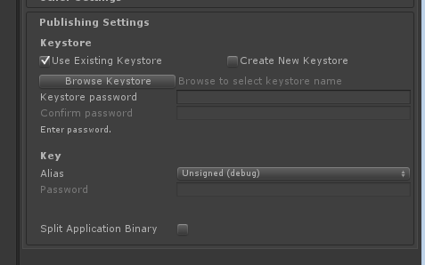
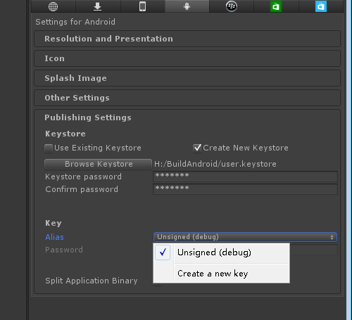
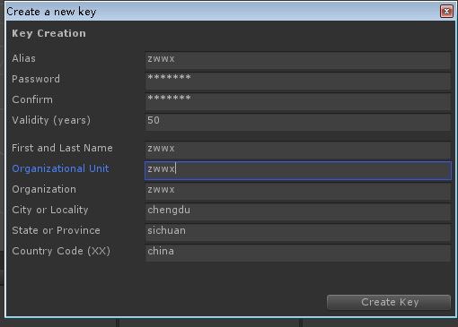
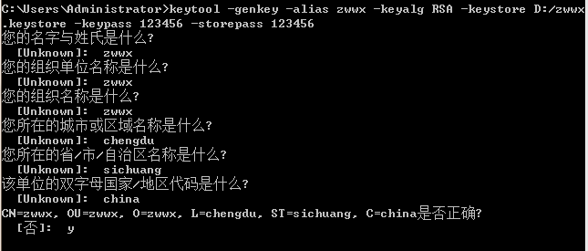
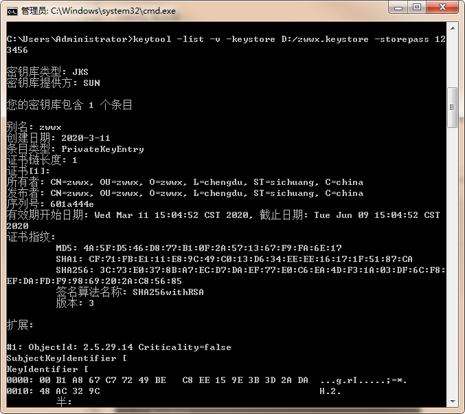
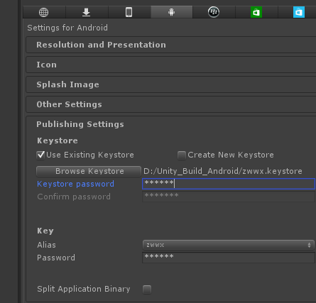

#Android 签名

在我们打包Android的时候，Unity需要我们设置Keystore,不设置则使用默认签名打包。

Keystore分为默认Keystore和自定义Keystore，通常应用发布时不用默认的Keystore，因为它不包含开发者的有效信息，且密码是android，任何人都可通过keytool指令对其内容进行修改，无法验证APP的有效性。

##keystore制作

Keytool ：是一个有效的安全钥匙和证书的管理工具，Java 中的 keytool.exe （位于 JDK\Bin 目录下）可以用来创建数字证书；

keystore：数字证书，是一个存储了证书的文件。文件包含证书的私钥，公钥和对应的数字证书的信息。

###通过Unity制作KeyStore

1. 勾选 Create New Keystore
2. Browse Keystore 选择新Keystore的保存位置
3. 输入keystore的密码
4. 点击 Aliass的Unsigned 选择菜单，选择Create a New KeyStore

1. 设置 Alias
2. 公司组织信息，位置等信息
3. create，注意保存keystore文件及keystore的密码和alias的密码，方便后续打包使用

### Keytool 命令制作keystore

    C:\Users\Administrator>keytool -genkey -alias zwwx -keyalg RSA -keystore D:/zwwx
    .keystore -keypass 123456 -storepass 123456

 

-genkey 生成秘钥

-alias 别名

-keyalg 秘钥算法

-keysize 秘钥长度

-validity 有效期

-keystore 生成秘钥库的存储路径和名称

-keypass 秘钥口令

-storepass 秘钥库口令

-dname 拥有者信息，CN：姓名；OU：组织单位名称；O：组织名称；L：省/市/自治区名称；C：国家/地区代码

###查看keystore 信息

    C:\Users\Administrator>keytool -list -v -keystore D:/zwwx.keystore -storepass 12
    3456

 

##签名

在Unity Build Setting 设置keystore

 

