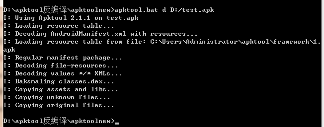
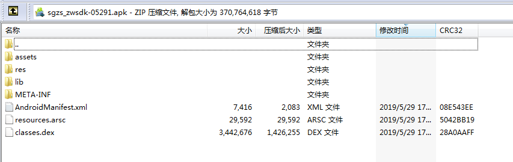
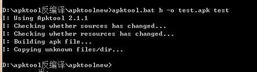

# Android APK 重签名

ApkTool

## APK 解包

###  用zip工具打开apk文件

直接用压缩工具解压缩apk到指定目录即可。

### 用apktool工具解开apk文件

apktool下载[ https://ibotpeaches.github.io/Apktool/install/](https://ibotpeaches.github.io/Apktool/install/)

 解包命令`apktool d test.apk`

 

注意： apktool的解部分apk文件可能会失败

##APK 包内容解析
 

1. META-INF目录：存放签名后的CERT和MANIFEST文件，用于识别软件的签名及版权。
2. res目录：存放各种Android原始资源，包括：动画anim、图片drawable、布局layout、menu菜单、xml等等
3. AndroidManifest.xml编码后的Android项目描述文件，包括了Android项目的名称、版本、权限、程序组件描述等等
4. classes.dex编译后Class被dx程序转换成Dalvik虚拟机的可执行字节码文件
5. resources.arsc所有文本资源的编译产物，里面包含了各Location对应的字符串资源。
6. lib目录：存放各种so文件 （C/C++代码NDK编译生成的库文件）。
7. asset目录： 存放各种资源文件，这部分文件在打包过程中不会修改。

## APK 修改

### 简单修改

1. asset目录下的文件可以方便的修改，一些配置文件等。但是不安全

2. 修改应用版本号只需要修改apktool.yml

### 高难度修改

最难修改的部分就是java代码，这里对应的是smali相关的文件夹，需要了解一些smali的语法才行。

## APK 重签

### 重编回apk文件
1. 方法一： 将解包得到的apk文件，用压缩工具，压缩成文件，修改文件后缀为apk
2. 方法二： 用apktool命令： `apktool.bat b -o 目标.apk apk解包目录`

### jarsigner 重签

1. 删除之前的签名文件

	用解压缩工具打开，删除 [META-INF] 文件夹

	META-INF目录：存放签名后的CERT和MANIFEST文件，用于识别软件的签名及版权。你  

2. 打开命令行窗口

3. [保证签名文件和apk在同一级目录下] 然后执行如下命令，将 (xx) 处替换自己的签名、apk 信息即可

jarsigner -verbose -keystore (签名文件 jks/keystore） -storepass (秘钥) -signedjar (签名后的 apk 名称 xx.apk) -digestalg SHA1 -sigalg MD5withRSA (要签名的 apk) (签名文件的别名)
    
    D:\apktool反编译\apktoolnew>jarsigner -verbose -keystore D:/zwwx.keystore -store
    pass 123456 -signedjar test-signed.apk -digestalg SHA1 -sigalg MD5withRSA test.a
    pk zwwx

## APK 压缩
字节对齐的工具`zipalign.exe`，这个在sdk的build-tools的版本下面，zipalign主要是用来用APK文件提供优化，目的是确保所有未压缩的数据以相对于文件的开始对齐。具体来说，它会导致APK中的所有未压缩数据（如图像或原始文件）在4字节边界上对齐。这允许所有的部分文件都能直接使用mmap进行访问，即使是包含具有对齐限制的二进制数据，这样会减少运行应用程序时消耗的内存量。

zipalign.exe的位置

`G:\Android\sdk\build-tools\19.1.0`

###对齐检查
命令如下：

`zipalign -c -v 4 dst.apk`

    G:\Android\sdk\build-tools\19.1.0>zipalign.exe -c -v 4 D:\apktool反编译\apktooln
    ew\test-signed.apk

##对齐操作
命令如下：
`zipalign -v 4 dst_signed.apk dst_signed_align.apk`

    G:\Android\sdk\build-tools\19.1.0>zipalign.exe -v 4 D:\apktool反编译\apktoolnew\
    test-signed.apk  D:\apktool反编译\apktoolnew\test-signed-alin.apk

## 参考

[https://developer.android.google.cn/studio/command-line](https://developer.android.google.cn/studio/command-line)