#Unity Android SDK对接(aar)

###环境：	
	 unity 2017.4.30f1
	Android Studio 3.3.1

#### Android Studio 设置

  打开Android Studio，菜单，File -》 Settings -》 System Settings
 
1. http-proxy 设置
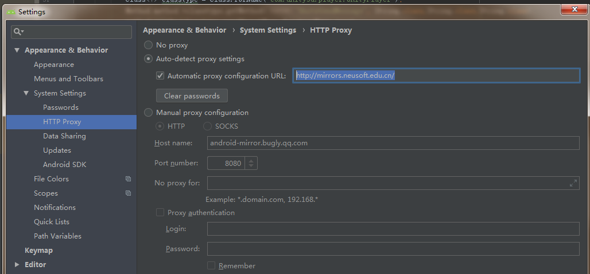

	http://mirrors.neusoft.edu.cn/

2. Android SDK

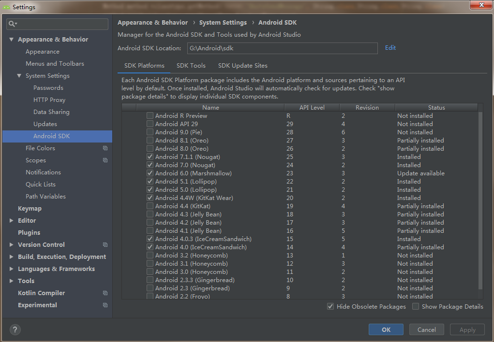

### Android SDK aar对接

新建 Android 工程

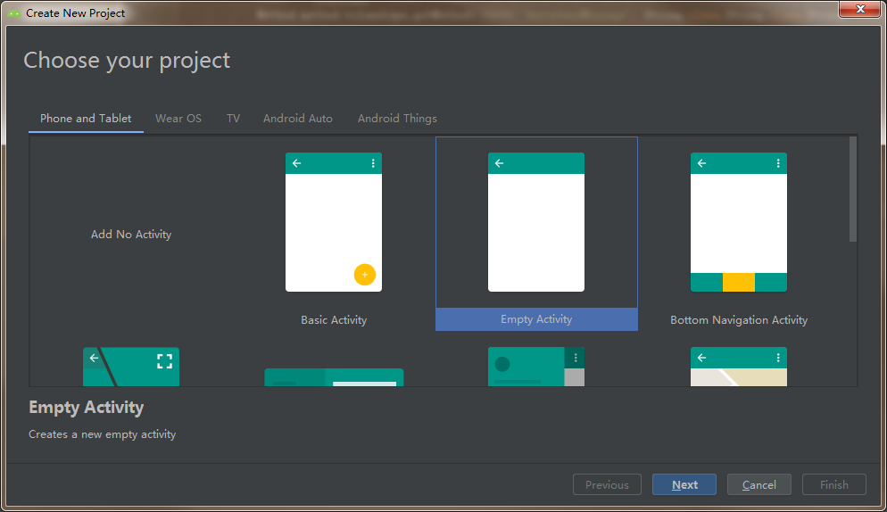

New module，选择Android Library， 新建chuxinsdk的library module。
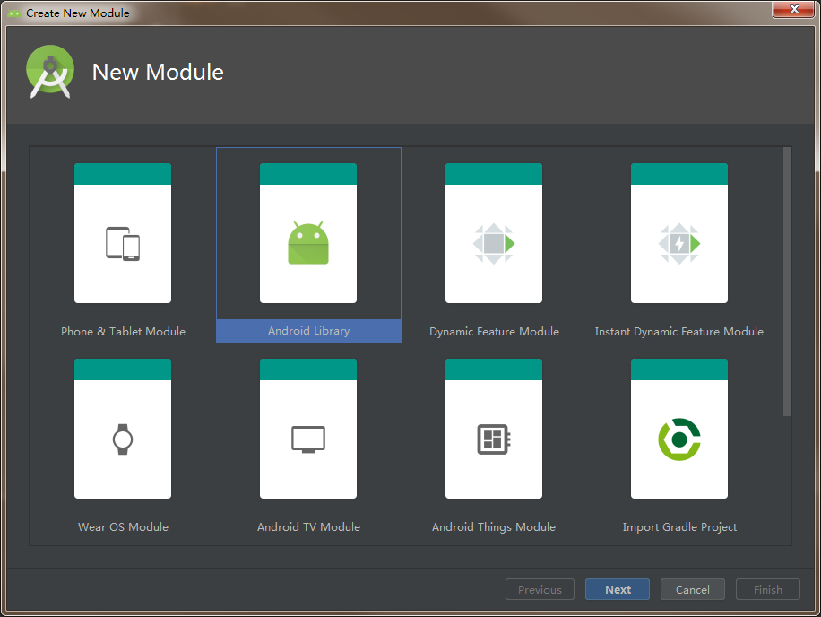

unity的class.jar
拷贝class.jar,重命名unity-class.jar。 具体位置
E:\Program Files\Unity2017.4.30f1\Editor\Data\PlaybackEngines\AndroidPlayer\Variations\il2cpp\Release\Classes

zwwxsdk.jar， zwwx游戏对接Android的接口封装。

打开chuxinsdk的文件位置，新建libs目录，拷贝unity-class.jar和 zwwxsdk.jar。 

设置Library module的jar dependencies, 选择module，
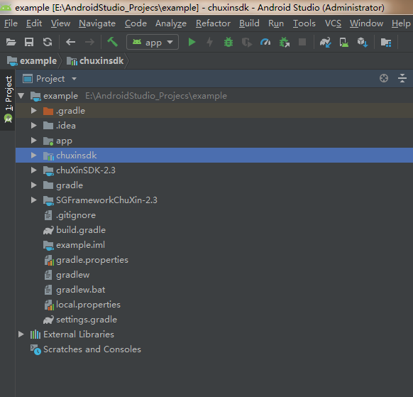

右键菜单 Open Module Settings

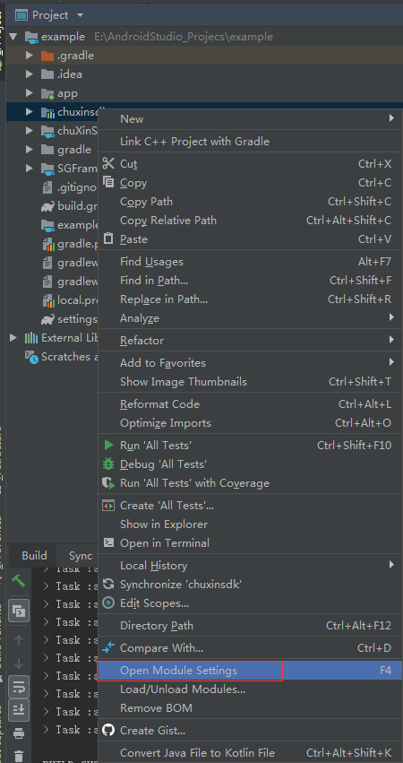

设置dependencies,点击+，选择jar dependency,选择libs目录下的unity-class.jar 、 zwwxsdk.jar。

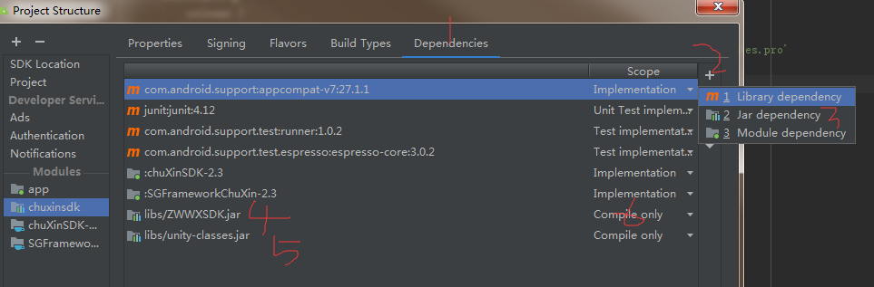

**注意选择scope，选择implementation，在build时，引用的jar会被打进aar文件中，选择compile only则不会**，这样在我们用unity打Android包的时候就不会，提示class 重复，（unity-class.jar是已经存在的，在unity内）

打开chuxinsdk/build.gradle，查看刚刚添加的jar dependencies.

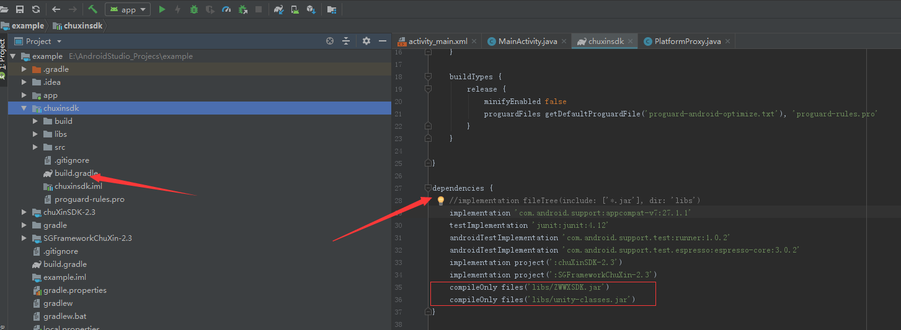

### chuxin SDK对接

引入初心 SDK aar文件：

chuXinSDK-2.3.aar

SGFrameworkChuXin-2.3.aar

菜单 File -》 New -》 Import Module, 安引导导入

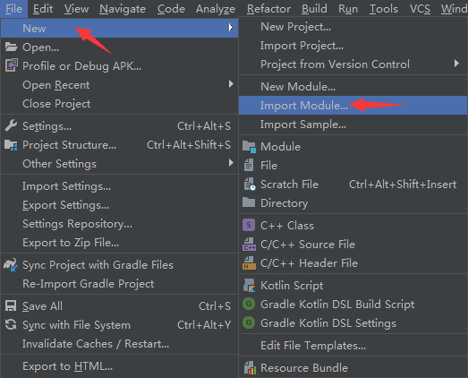

设置 Module dependency

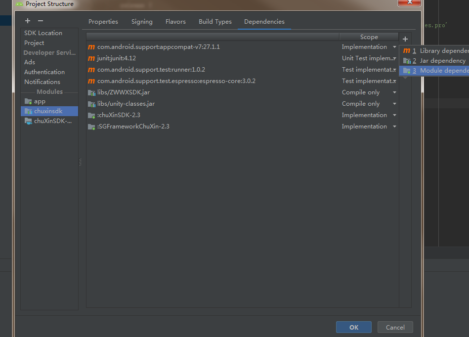

chuxinsdk的build.gradle如下

	dependencies {
	    //implementation fileTree(include: ['*.jar'], dir: 'libs')
	    implementation 'com.android.support:appcompat-v7:27.1.1'
	    testImplementation 'junit:junit:4.12'
	    androidTestImplementation 'com.android.support.test:runner:1.0.2'
	    androidTestImplementation 'com.android.support.test.espresso:espresso-core:3.0.2'
	    implementation project(':chuXinSDK-2.3')
	    implementation project(':SGFrameworkChuXin-2.3')
	    compileOnly files('libs/ZWWXSDK.jar')
	    compileOnly files('libs/unity-classes.jar')
	}

注意 注掉 implementation fileTree(include: ['*.jar'], dir: 'libs')。

配置好后，可以尝试选择build-》rebuild，是否成功生成 aar文件。

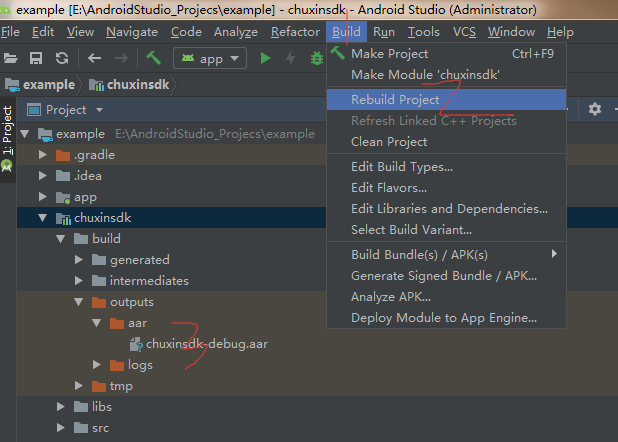

###SDK 对接接口的实现

在chuxinsdk， src/main下，新建com.zwwx.platform.PlatformProxy.java类，实现SDK对接相关的接口。

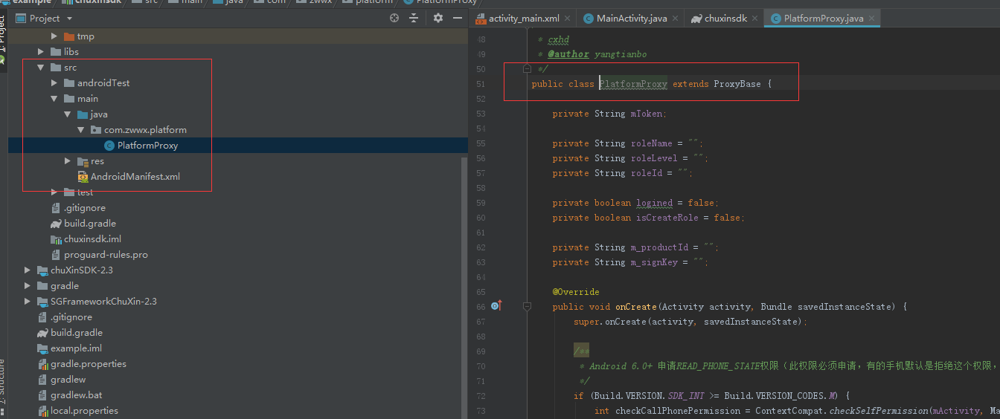

rebuild 导出aar；拷贝到Unity Plugin Android目录下,记得拷贝SDK相关的aar文件。

Unity 打包Android，注意选择build system位Gradle。

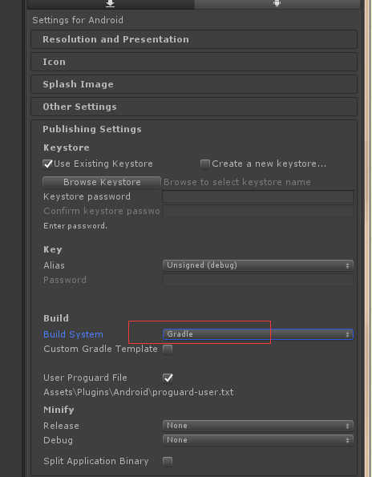

