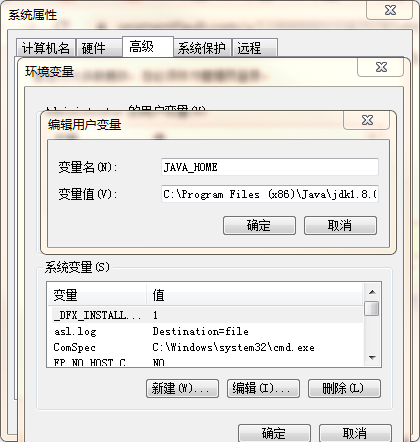
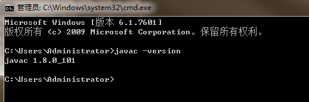
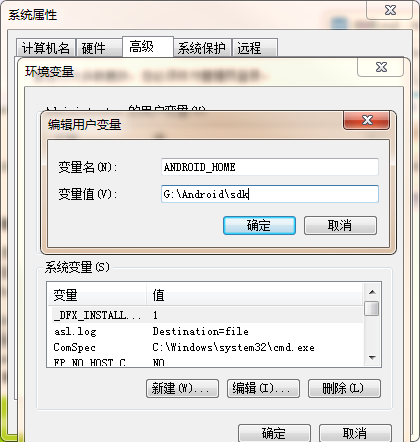
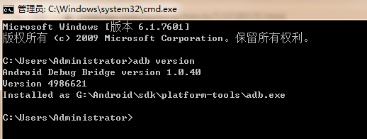
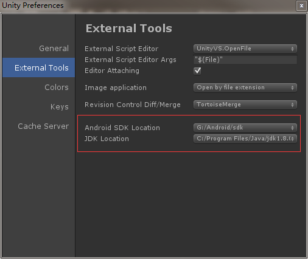
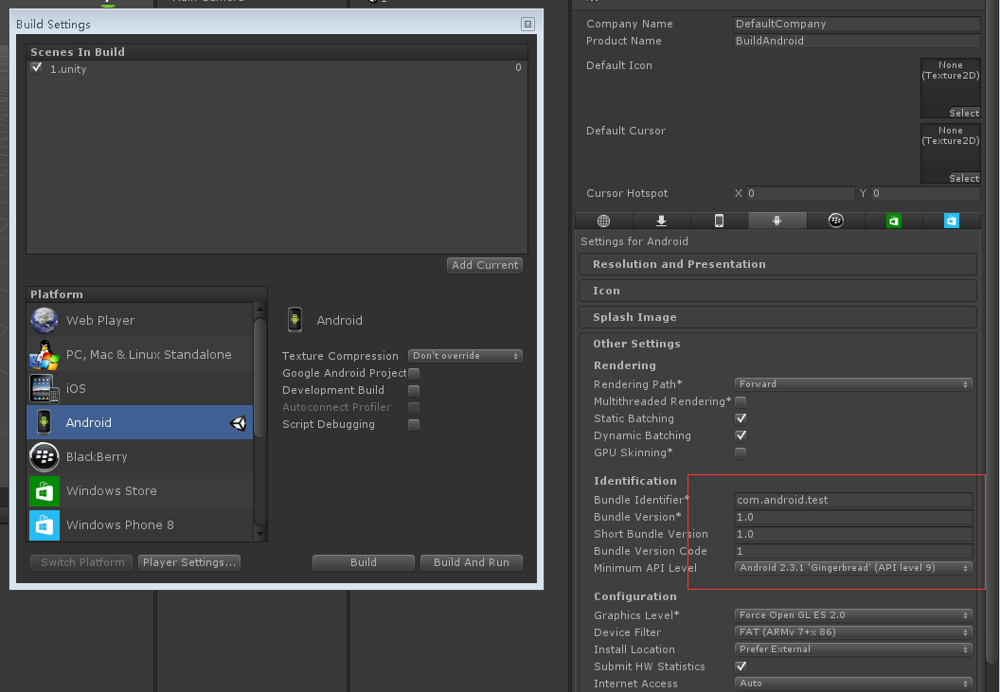

#Unity Android 打包

##环境

在 `\\192.168.1.183\software\Android环境安装软件`目录下，放了Android SDK的压缩包，及JDK安装包，可以快速获取。

### Unity安装

选择各自项目对应的Unity版本安装。

下载地址 [https://www.unity.cn/releases](https://www.unity.cn/releases)

### 安装JDK

1. 下载地址 [http://www.oracle.com/technetwork/java/javase/downloads/index.html](http://www.oracle.com/technetwork/java/javase/downloads/index.html) （注意是下载JDK，不是JRE）
2. 环境变量设置

	（计算机右键->属性->高级系统设置->环境变量）
	
	用户变量添加 JAVA_HOME
	
	
	新增变量名"ClassPath" 变量值".;%Java_Home%\bin;%Java_Home%\lib\dt.jar;%Java_Home%\lib\tools.jar"

	修改变量名"Path" 变量值最前面加"%Java_Home%\bin;%Java_Home%\jre\bin;"

3. 检查是否安装成功
	
 打开cmd,输入 `javac -version`

	

### Android SDK
1. 下载 [http://developer.android.com/sdk/index.html](http://developer.android.com/sdk/index.html) （需要翻墙）

	192.168.1.183 共享 Android-SDK.zip

2. 配置环境变量；新增变量名"Android_Home" 变量值如"D:\Android\sdk"

3. 检验一下Android SDK是否安装成功：在命令行窗口中输入”adb version“，出现如下显示，则安装成功了：

### Unity配置Android SDK、JDK

打开Unity，菜单栏 Edit--》Prefere --》 External Tools

## Unity打包

新建一个Unity的空工程，测试Unity打包Android环境是否正常。

设置好bundle identifier，直接build。如果打出apk文件，说明环境安装成功！

##脚本自动打包
主要是通过脚本传入参数，调用Unity执行Android打包。

##Android Studio打包

需要将Unity工程导出为Android工程